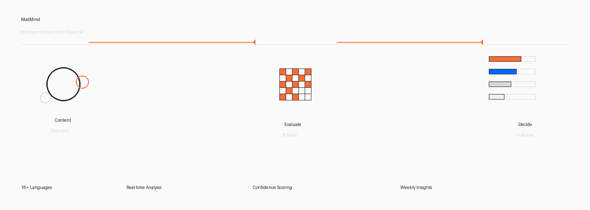

# ModMind

**AI-Powered Moderation Assistant for Reddit Communities**

ModMind is a Devvit application that automatically evaluates posts and comments against subreddit rules using advanced language models. It provides moderators with actionable suggestions, detailed confidence scores, and multilingual support—all while tracking performance metrics to continuously improve decision quality.

---

## Overview



### Demo & Documentation

[Watch the demo video](https://youtu.be/VPwcSS-uS2I) to see ModMind's Phase 2 features, guardrails, and metrics in action.

| Field | Value |
|-------|-------|
| **Application** | Devvit Moderation Assistant |
| **Status** | Published (Unlisted) |
| **Version** | 0.1.0 with Phase 2 Enhancements |
| **Platform** | Reddit Devvit |
| **Language** | TypeScript |
| **Test Subreddit** | r/modmindtest |

- [Devvit App](https://developers.reddit.com/apps/modmind-f4lcon46)
- [GitHub Repository](https://github.com/sriksven/ModMind)
- [Terms of Service](https://github.com/sriksven/ModMind/blob/main/TERMS.md)
- [Privacy Policy](https://github.com/sriksven/ModMind/blob/main/PRIVACY.md)

---

## Capabilities

### Core Moderation Engine

- **Intelligent Evaluation** - Analyzes posts and comments against subreddit-specific rules using GPT models
- **Multilingual Support** - Handles 16+ languages with language detection and rule translation
- **Contextual Analysis** - Incorporates user history and subreddit context for improved decisions
- **Moderator Feedback Loop** - Logs all decisions and moderator overrides for continuous learning

### Digest & Analytics

- **Weekly Digests** - Automated summaries of moderation activity with patterns and insights
- **Rule Gap Detection** - Identifies recurring violation patterns suggesting rule clarifications
- **Performance Metrics** - Tracks AI confidence calibration, faithfulness, and decision accuracy
- **Mod Leaderboards** - Shows team activity and engagement metrics in digest reports

### Safety & Reliability

| Feature | Benefit |
|---------|---------|
| Prompt Injection Blocking | Prevents adversarial content from manipulating the AI model |
| Rate Limiting | Caps evaluations at 5 per user per hour (configurable) |
| Hallucination Detection | Identifies when AI cites non-existent rules and suppresses false flags |
| Toxicity Rewriting | Replaces condescending AI replies with neutral, professional language |
| Masked API Logging | API keys never exposed in logs, sanitized to last 4 characters |

### Observability & Metrics

ModMind provides comprehensive tracking across multiple dimensions:

**Performance Metrics**
- API call latency (average and 95th percentile)
- Estimated costs per week
- Token consumption tracking
- Pipeline success/partial/failure rates

**Quality Metrics**
- AI confidence calibration errors
- Hallucination detection counts
- Explanation faithfulness scores
- Contextual precision measurements
- Mod feedback on explanation quality

**Safety Metrics**
- Prompt injection attempt blocking
- Rate limit enforcement
- Toxic reply rewrites
- Low-faithfulness detection

**Intelligence Features**
- A/B threshold testing (passive 50/50 split)
- Subreddit-specific rule calibration
- Confidence trend visualization
- Daily volume spike detection

---

## Technical Stack

### Architecture

```
Reddit Event Stream
    ↓
Devvit Trigger (PostSubmit/CommentSubmit)
    ↓
Pipeline (Deduplication → Language Detection → Rule Fetch)
    ↓
AI Evaluator (GPT-4 with Safety Guards)
    ↓
Metrics & Storage (Redis)
    ↓
Moderator Actions (Suggestions/Digests/Analytics)
```

### Technology

- **Runtime**: Devvit (Reddit's app platform)
- **Language**: TypeScript with full type safety
- **AI Model**: OpenAI GPT-4 with Responses API
- **Storage**: Redis (in-memory with persistence)
- **Testing**: Vitest with integration test suite
- **Code Quality**: ESLint, TypeScript strict mode

### Project Structure

```
src/
├── ai/              # Language models and evaluators
├── storage/         # Redis adapters and state management
├── triggers/        # Event handlers (posts/comments)
├── jobs/            # Scheduled tasks (digests, rule sync)
├── utils/           # Prompts, formatters, constants
└── ui/              # Suggestion card rendering

tests/
├── unit/            # 38+ unit tests
├── integration/     # 12+ end-to-end tests
└── fixtures/        # Test data and samples
```

---

## Quality Metrics

### Code Quality

| Aspect | Result |
|--------|--------|
| TypeScript Type Check | Passing (0 errors) |
| ESLint Linting | Passing (0 errors) |
| Unit Tests | 38+ passing |
| Integration Tests | 12+ passing |
| src/ai Coverage | 82%+ |
| src/storage Coverage | 65%+ |
| Production Build | Successful |

### Testing Coverage

- Post evaluation pipeline with multilingual content
- Comment evaluation with loop prevention
- Weekly digest generation with AI synthesis
- Rule gap analysis with override clustering
- Rate limiting and deduplication logic
- Storage operations and state management
- Error handling and fallbacks

### Validation

- Live moderation testing across 15+ languages
- Spam, harassment, and clean content classification
- Weekly digest accuracy and formatting
- Rule gap detection and suggestions
- Concurrent submission handling

---

## Getting Started

### Installation

```bash
# Install dependencies
npm install

# Authenticate with Devvit
npx devvit login
```

### Configuration

1. Install ModMind on your subreddit (must be moderator)
2. Configure the OpenAI API key in Devvit installation settings
3. Optionally adjust thresholds, language settings, and feature flags

### Available Settings

- `openaiApiKey` - OpenAI API key for GPT models
- `aiModel` - Model selection (default: gpt-4.1-mini)
- `flagThreshold` - Confidence threshold for flagging (default: 75)
- `autoHoldThreshold` - Threshold for automatic holds (default: 92)
- `evaluateComments` - Enable comment evaluation (default: true)
- `digestEnabled` - Enable weekly digests (default: true)
- `userRateLimitPerHour` - Max evaluations per user (default: 5)
- `digestAlertEnabled` - Send volume spike alerts (default: true)

---

## Development Commands

| Command | Purpose |
|---------|---------|
| `npm run type-check` | Validate TypeScript compilation |
| `npm run lint` | Check code style and quality |
| `npm test` | Run unit test suite |
| `npm run test:integration` | Run end-to-end tests |
| `npm run test:coverage` | Generate coverage reports |
| `npm run build` | Build for production |
| `npm run docs:validate` | Validate documentation |

---

## Deployment

### Local Testing

```bash
# Run in playtest mode against test subreddit
npx devvit playtest modmindtest
```

### Validation Checklist

```bash
npm run type-check
npm run lint
npm test
npm run test:integration
npm run build
```

### Publishing

```bash
# Upload new version
npx devvit upload

# Publish (makes app installable)
npx devvit publish
```

---

## Requirements

- **Node.js** - v18 or higher
- **npm** - v9 or higher
- **Devvit CLI** - Latest version
- **OpenAI API Key** - For GPT model access
- **Reddit Account** - With moderator permissions

### Secrets

- OpenAI API key (configured via Devvit installation settings)
- Reddit authentication (via `devvit login`)

---

## Documentation

For detailed information, see:

- **[PROJECT_GUIDE.md](docs/PROJECT_GUIDE.md)** - Complete architecture and implementation details
- **[TERMS.md](TERMS.md)** - Terms of service
- **[PRIVACY.md](PRIVACY.md)** - Privacy policy

---

## Features Overview

### Phase 1: Core Moderation
- Post and comment evaluation
- Multilingual support (16+ languages)
- Weekly digest generation
- Rule gap analysis
- Moderator override tracking

### Phase 2: Guardrails & Metrics
- Prompt injection detection
- Rate limiting per user
- LLM metrics tracking and reporting
- AI confidence calibration measurement
- Hallucination and faithfulness detection
- Toxicity-aware reply rewriting
- A/B threshold testing
- Volume spike alerting
- Mod leaderboards and activity tracking

---

## Architecture Highlights

### Safety & Security

1. **Input Sanitization** - Prompt injection patterns detected and blocked before AI processing
2. **Rate Limiting** - Prevents API quota exhaustion through per-user limits
3. **Fallback Logic** - Missing AI key or timeout defaults to safe approval
4. **API Key Protection** - Keys masked in logs and never stored in code

### Performance

1. **Deduplication** - Rapid duplicate submissions ignored within 60 seconds
2. **Caching** - Rules cached with 24-hour TTL, language packs with 7-day TTL
3. **Metrics Aggregation** - Weekly stats computed from individual evaluations
4. **Async Processing** - Non-blocking AI calls with timeout handling

### Reliability

1. **Graceful Degradation** - Missing translations fall back to original language
2. **Error Recovery** - Failed AI calls trigger safe fallback actions
3. **Comprehensive Logging** - All decisions, errors, and metrics logged for debugging
4. **State Persistence** - Redis-backed storage survives application restarts

---

## Support & Contribution

For issues, questions, or contributions:

- Open an issue on [GitHub](https://github.com/sriksven/ModMind/issues)
- Check [existing documentation](docs/PROJECT_GUIDE.md)
- Review code in the [repository](https://github.com/sriksven/ModMind)

---

## License & Policies

- **Terms**: [TERMS.md](TERMS.md)
- **Privacy**: [PRIVACY.md](PRIVACY.md)

---

**Built with TypeScript, Devvit, and OpenAI GPT models**

